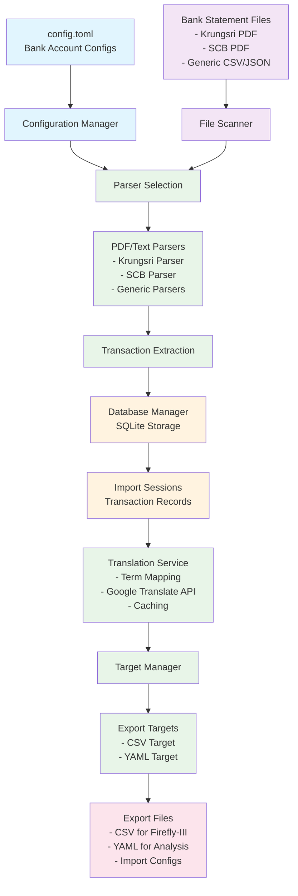

# Bank Importer Thailand

[](https://github.com/jochemvangrondelle/bank-importer-th/actions/workflows/ci.yml)
[](https://github.com/jochemvangrondelle/bank-importer-th/actions/workflows/release.yml)
[](https://opensource.org/licenses/AGPL-3.0)
[](https://www.python.org/downloads/)
[](https://hub.docker.com/)

A Python application that parses Thai bank export PDFs and exports transactions to CSV format suitable for import into Firefly-III or other. The application is designed to support alternative export formats and other parsers, with contributions welcome.

## Data Flow Architecture



## Overview

This application is specifically designed for Thai bank statements but built with extensibility in mind. It currently supports:

- **Krungsri Bank** (PDF and text formats)
- **Siam Commercial Bank (SCB)** (PDF format)
- **American Express Thailand** (CSV format)
- **Generic parsers** for CSV, JSON, and fixed-width formats

The application exports to CSV format optimized for Firefly-III's import system, but is intentionally designed without a direct Firefly-III target to rely on Firefly's own robust importer.

## Features

### 🏦 **Supported Banks**

- **Krungsri Bank**: PDF and text statement parsing
- **Siam Commercial Bank (SCB)**: PDF statement parsing
- **American Express Thailand**: CSV statement parsing with foreign currency support
- **Generic parsers**: CSV, JSON, and fixed-width file support

### 📊 **Export Formats**

- **CSV**: Optimized for Firefly-III import with comprehensive transaction data
- **YAML**: Human-readable format for data validation and analysis
- **Import configurations**: Auto-generated Firefly-III import configs

### 🌐 **Translation Support**

- **Thai to English translation**: Automatic translation of transaction descriptions
- **Financial terms mapping**: Pre-defined Thai financial terminology
- **Google Translate integration**: Full sentence translation for complex descriptions
- **Translation caching**: Persistent cache to avoid repeated API calls

### 🔧 **Advanced Features**

- **Duplicate detection**: Prevents importing the same transaction multiple times
- **External ID generation**: Unique identifiers for transaction tracking
- **Comprehensive metadata**: Balance information, transaction types, channels
- **Flexible configuration**: Easy setup for multiple accounts and banks

## Quick Start

### Installation

#### Option 1: PyPI Installation (Recommended for Users)

```bash
# Install from PyPI
pip install bank-importer-th

# Or with uv
uv add bank-importer-th
```

#### Option 2: Local Installation (Recommended for Development)

```bash
# Clone the repository
git clone https://github.com/jochemvangrondelle/bank-importer-th.git
cd bank-importer-th

# Install dependencies
uv sync

# Copy and configure the example configuration
cp config-example.toml config.toml
# Edit config.toml with your account details
```

#### Option 2: Docker Installation (Recommended for Production)

```bash
# Clone the repository
git clone https://github.com/jochemvangrondelle/bank-importer-th.git
cd bank-importer-th

# Build the Docker image
docker build -t bank-importer-th .

# Or use docker-compose (recommended)
docker-compose build
```

### Basic Usage

#### Local Installation

```bash
# Using uv run (traditional way)
uv run python -m bank_importer_th import-files data/in/
uv run python -m bank_importer_th export-multi
uv run python -m bank_importer_th status

# Using direct script (new way)
bank-importer-th import-files data/in/
bank-importer-th export-multi
bank-importer-th status
```

#### Docker Usage

```bash
# Using docker run
docker run --rm -v $(pwd)/data:/app/data -v $(pwd)/config.toml:/app/config.toml bank-importer-th import-files data/in/
docker run --rm -v $(pwd)/data:/app/data -v $(pwd)/config.toml:/app/config.toml bank-importer-th export-multi
docker run --rm -v $(pwd)/data:/app/data -v $(pwd)/config.toml:/app/config.toml bank-importer-th status

# Using docker-compose (recommended)
docker-compose run --rm bank-importer import-files data/in/
docker-compose run --rm bank-importer export-multi
docker-compose run --rm bank-importer status
```

### Docker Support

The application is containerized for easy deployment and consistent environments across different systems.

### Docker Features

- **Multi-stage build**: Optimized for size and security
- **Non-root user**: Runs as `appuser` for security
- **Volume mounts**: Easy data persistence and configuration
- **Timezone support**: Configurable timezone via `config.toml`
- **PDF processing**: Includes all necessary system dependencies

### Docker Usage

#### Quick Start with Docker Compose

```bash
# Build the image
docker-compose build

# Import bank statements
docker-compose run --rm bank-importer import-files data/in/

# Export to CSV
docker-compose run --rm bank-importer export-multi

# Check status
docker-compose run --rm bank-importer status
```

#### Manual Docker Commands

```bash
# Build the image
docker build -t bank-importer-th .

# Run with volume mounts
docker run --rm \
  -v $(pwd)/data/in:/app/data/in:ro \
  -v $(pwd)/data/out:/app/data/out \
  -v $(pwd)/config.toml:/app/config.toml:ro \
  bank-importer-th import-files data/in/

# Export transactions
docker run --rm \
  -v $(pwd)/data/in:/app/data/in:ro \
  -v $(pwd)/data/out:/app/data/out \
  -v $(pwd)/config.toml:/app/config.toml:ro \
  bank-importer-th export-multi
```

#### Docker Volume Structure

```
your-project/
├── data/
│   ├── in/          # Bank statement files (read-only)
│   └── out/         # Generated exports (read-write)
├── config.toml      # Configuration file (read-only)
├── logs/            # Application logs (optional)
└── docker-compose.yml
```

#### Environment Variables

The Docker container supports the following environment variables:

- `PYTHONPATH`: Python path (automatically set)
- `PATH`: Includes local bin directory

**Note**: Timezone is now configured in `config.toml` under the `[app]` section instead of using the `TZ` environment variable.

#### Security Considerations

- Runs as non-root user (`appuser`)
- Read-only mounts for input files and configuration
- Minimal base image (Python slim)
- No persistent secrets in image

## Configuration

Edit `config.toml` with your account details:

### Application Settings

```toml
[app]
# Default timezone for all date/time operations
timezone = "Asia/Bangkok"
```

### Account Configuration

```toml
[[accounts]]
name           = "krungsri_main"
parser         = "krungsri_pdf"
file_pattern   = "*.pdf"
file_path      = "data/in/Krungsri"
account_number = "YOUR_ACCOUNT_NUMBER"
account_name   = "YOUR_NAME"
bank_name      = "Krungsri Bank"
password       = "YOUR_PASSWORD"

[[accounts]]
name           = "amex_th_csv"
parser         = "amex_th_csv"
file_pattern   = "*.csv"
file_path      = "data/in/amex_th"
account_number = "XXXX-XXXXXX-43002"
account_name   = "TH - CC AMEX (Billed / Uncharged)"
bank_name      = "American Express Thailand"
currency       = "THB"
country_code   = "TH"
```

## Project Structure

```
bank-importer-th/
├── src/bank_importer_th/
│   ├── banks/           # Bank-specific parsers
│   ├── targets/         # Export format handlers
│   ├── translation_terms/ # Thai financial terms
│   └── models/          # Data models
├── data/in/             # Bank statement files
├── data/out/            # Generated exports
├── config.toml          # Configuration (not in repo)
├── config-example.toml  # Example configuration
├── Dockerfile           # Docker container definition
├── docker-compose.yml   # Docker Compose configuration
├── .dockerignore        # Docker build exclusions
└── README.md
```

## Entry Points

The application provides multiple ways to run:

### Script Entry Point

After installation, you can run the application directly:

```bash
# Direct script execution
bank-importer-th --help
bank-importer-th import-files data/in/
bank-importer-th export-multi
```

### Module Entry Point

Traditional Python module execution:

```bash
# Module execution
uv run python -m bank_importer_th --help
uv run python -m bank_importer_th import-files data/in/
```

### Docker Entry Point

Containerized execution:

```bash
# Docker execution
docker run --rm bank-importer-th --help
docker-compose run --rm bank-importer import-files data/in/
```

## Supported Banks

### Krungsri Bank

- **Formats**: PDF and text statements
- **Features**: Password-protected PDF support
- **File patterns**: `*.pdf`, `*.txt`

### Siam Commercial Bank (SCB)

- **Formats**: PDF statements
- **Features**: Monthly statement parsing
- **File patterns**: `*AcctSt_*.pdf`

### American Express Thailand

- **Formats**: CSV statements
- **Features**:
  - Foreign currency transaction support with conversion rates
  - Country code detection in merchant names (e.g., "SHOPEETH" → "SHOPEE TH")
  - Amount normalization (expenses negative, repayments positive)
  - Unique ID generation using AMEX reference numbers
  - Comprehensive transaction metadata preservation
- **File patterns**: `*.csv`
- **Account configuration**: Requires `account_name`, `account_number`, `currency`, and `country_code`

### Generic Parsers

- **CSV**: Flexible CSV import with header detection
- **JSON**: JSON transaction data import
- **Fixed-width**: Legacy bank statement formats

## Export Formats

### CSV Export

Optimized for Firefly-III import with:

- Comprehensive transaction metadata
- Thai to English translation
- Duplicate detection
- Import configuration files

### YAML Export

Human-readable format for:

- Data validation
- Transaction analysis
- Debugging and development

## Translation Features

The application includes sophisticated Thai to English translation:

- **Financial terms mapping**: Pre-defined Thai banking terminology
- **Google Translate integration**: Full sentence translation
- **Smart caching**: Persistent translation cache
- **Fallback handling**: Original text preserved if translation fails

## Contributing

Contributions are welcome! The project is designed for extensibility:

### Adding New Banks

1. Create a new parser in `src/bank_importer_th/banks/`
2. Implement the `Parser` interface
3. Add configuration examples
4. Update documentation

### Adding New Export Formats

1. Create a new target in `src/bank_importer_th/targets/`
2. Implement the `Target` interface
3. Add configuration options
4. Update documentation

### Translation Improvements

- Add new Thai financial terms to `translation_terms/thai_terms.py`
- Improve translation logic in `translation_service.py`
- Add support for additional languages

## Development

### Setup Development Environment

```bash
# Install development dependencies
uv sync --extra dev

# Run tests
uv run pytest

# Type checking
uv run mypy src/

# Code formatting
uv run ruff format src/
```

### Docker Development

```bash
# Build development image
docker build -t bank-importer-th:dev .

# Run with development volumes
docker run --rm -it \
  -v $(pwd)/src:/app/src \
  -v $(pwd)/data:/app/data \
  -v $(pwd)/config.toml:/app/config.toml \
  bank-importer-th:dev bash

# Test Docker build
docker build -t bank-importer-th:test .
docker run --rm bank-importer-th:test --help
```

### Publishing to Docker Hub

To publish the Docker image to Docker Hub:

```bash
# Build with proper tags
docker build -t yourusername/bank-importer-th:latest .
docker build -t yourusername/bank-importer-th:v0.0.1 .

# Push to Docker Hub
docker push yourusername/bank-importer-th:latest
docker push yourusername/bank-importer-th:v0.0.1
```

### Docker Best Practices

- **Multi-stage builds**: Reduces final image size
- **Non-root user**: Improves security
- **Volume mounts**: Keeps data persistent
- **Read-only mounts**: Protects input files
- **Environment variables**: Configurable behavior

### Project Architecture

The application follows a modular architecture:

- **Parsers**: Bank-specific transaction parsing
- **Targets**: Export format handlers
- **Models**: Data structures and database models
- **Translation**: Thai to English translation service
- **CLI**: Command-line interface for user interaction

## Security

### 🔒 **Security Considerations**

- **No sensitive data storage**: The application does not store bank credentials or sensitive financial information
- **Local processing**: All data processing happens locally on your machine
- **Optional API keys**: Google Translate API key is optional and only used for translation
- **Docker security**: Runs as non-root user with minimal permissions

### 🛡️ **Best Practices**

- Keep your `config.toml` file secure and never commit it to version control
- Use strong passwords for password-protected PDF files
- Regularly update dependencies for security patches
- Review exported data before importing into financial management systems

## Support

For issues, feature requests, or contributions:

- Open an issue on GitHub
- Submit a pull request
- Check the documentation in the `docs/` directory

## Version Management

The project uses `bump2version` for automated version management and releases.

### 🔢 **Version Information**

```bash
# Show current version
bank-importer-th version

# Show version via Makefile
make version
```

### 📈 **Version Bumping**

```bash
# Bump patch version (0.1.0 -> 0.1.1)
make bump-patch
# or
uv run bump2version patch

# Bump minor version (0.1.0 -> 0.2.0)
make bump-minor
# or
uv run bump2version minor

# Bump major version (0.1.0 -> 1.0.0)
make bump-major
# or
uv run bump2version major
```

### 🚀 **Automated Releases**

The project includes GitHub Actions workflows for automated releases:

- **CI Workflow** (`.github/workflows/ci.yml`): Runs tests and builds on every push
- **Release Workflow** (`.github/workflows/release.yml`): Creates releases and Docker images on version tags

### 🐳 **Docker Version Tags**

Docker images are automatically tagged with version numbers:

```bash
# Build with version tag
make docker-build

# Push to registry
make docker-push

# Complete release process
make release
```

### 📋 **Version Files**

- **`pyproject.toml`**: Package version for distribution (single source of truth)
- **`src/bank_importer_th/__init__.py`**: Python package version
- **`.bumpversion.cfg`**: Configuration for automated version bumping

## Recent Enhancements

### 🐳 **Docker Support**

- **Universal Docker image**: Multi-stage build optimized for size and security
- **Non-root execution**: Runs as `appuser` for enhanced security
- **Volume mounts**: Easy data persistence and configuration management
- **Docker Compose**: Simplified deployment with `docker-compose.yml`

### 📦 **Script Entry Points**

- **Direct script execution**: `bank-importer-th` command after installation
- **Module execution**: Traditional `uv run python -m bank_importer_th`
- **Docker execution**: Containerized `docker run bank-importer-th`

### 📊 **Enhanced Documentation**

- **Mermaid data flow diagram**: Visual representation of the application architecture
- **Comprehensive Docker guide**: Complete setup and usage instructions
- **Multiple installation options**: Local development vs. production deployment

### 🔧 **Development Improvements**

- **Docker development environment**: Easy setup for contributors
- **Publishing guidelines**: Instructions for Docker Hub distribution
- **Best practices**: Security and performance recommendations

### 💳 **American Express Thailand Support**

- **CSV parser**: Full support for AMEX Thailand CSV statement format
- **Foreign currency handling**: Automatic conversion rates and original currency preservation
- **Smart merchant formatting**: Country code detection (e.g., "SHOPEETH" → "SHOPEE TH")
- **Amount normalization**: Consistent expense/income direction across all banks
- **Unique ID generation**: Uses AMEX reference numbers for duplicate prevention
- **Comprehensive testing**: Full test suite with anonymized sample data

---

**Note**: This project is in active development. While functional for supported banks, it may have bugs or missing features. Contributions and feedback are highly appreciated! Please test thoroughly with your specific bank statements before using in production.
